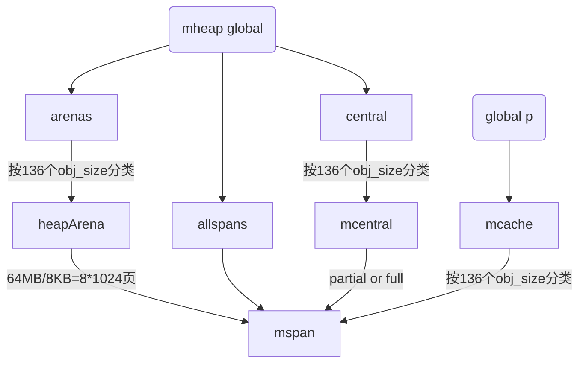

### 一、结构体 & 关系



<details>
  <summary>mheap</summary>
```go
// heap 内存计算：
// 1. arenas 8*4*1024*1024 = 32MB
type mheap struct {
	allspans []*mspan // all spans out there
	arenas [1 << arenaL1Bits]*[1 << arenaL2Bits]*heapArena // 维度非windows是 1和4*1024*1024
	central [numSpanClasses]mcentral // 68 << 1 代表不同size的对象分配
}
```
</details>

<details>
  <summary>mspan</summary>
```golang
// 管理 npages * 8KB 大小内存
type mspan struct {  
    next *mspan     // next span in list, or nil if none  
    prev *mspan
    startAddr uintptr // address of first byte of span aka s.base()  
	npages    uintptr // number of pages in span
	
	freeindex uintptr // header index for free
	nelems uintptr // number of object in the span.
	elemsize uintptr       // computed from sizeclass or from npages
}
```
</details>

<details>
  <summary>heapArena</summary>
```golang
// 64MB
type heapArena struct {
	bitmap [heapArenaBitmapWords]uintptr // 64MB/8/8/8 = 128*1024。第一个8表示8每8byte为一个指针，后面8*8表示一个uintptr有8*8个bit
	spans [pagesPerArena]*mspan // 64M/8KB = 8 * 1024个mspan，如果一个mspan管理多个页，那么连续的spans可能指向同一个mspan
	pageInUse [pagesPerArena / 8]uint8
}
```
</details>

<details>
  <summary>mcentral</summary>
```golang
// spanSet 是 *mspan数组
type mcentral struct {
	partial [2]spanSet // list of spans with a free object  
	full    [2]spanSet // list of spans with no free objects
}
```
</details>

<details>
  <summary>mcache</summary>
```golang
// mcache 有mcache0作为global，每个P对应一个mcache
type mcache struct {
	tiny       uintptr  
	tinyoffset uintptr  
	tinyAllocs uintptr
	alloc [numSpanClasses]*mspan // spans to allocate from, indexed by spanClass
}
```
</details>

136个`obj_size`：136个`obj_size`是因为67个跨度类 + 1个大object(超过32KB)，然后乘2（最后1bit用来区分是否含指针，GC用）。

`mheap`：全局的内存管理。

`arenas`：基于 `obj_size` 的物理内存的管理，按64MB去管理物理内存，将物理内存划分为8096个`mspan`。

`mcentral`：基于 `obj_size` 的内存分配管理，标识`mspan`的使用情况，`full` 还是 `partial`

`mcache`：绑定在`p`上，`p`运行时需要不同大小的内存，从不同的`mspan`中分配，当绑定的`mspan`内存用完时，不再指向该`mspan`，从`mcentral`申请一个新的。（注：GC时应该会把有可用空间的`mspan`从`mcentral`的`full`移到`partial`，然后`mcache`
### 初始化
#### mheap 初始化
#### mcentral 初始化

#### mcache 初始化

### 扩容
#### mheap扩容

#### mcache扩容

### GC
#### mheap GC
#### mcache GC